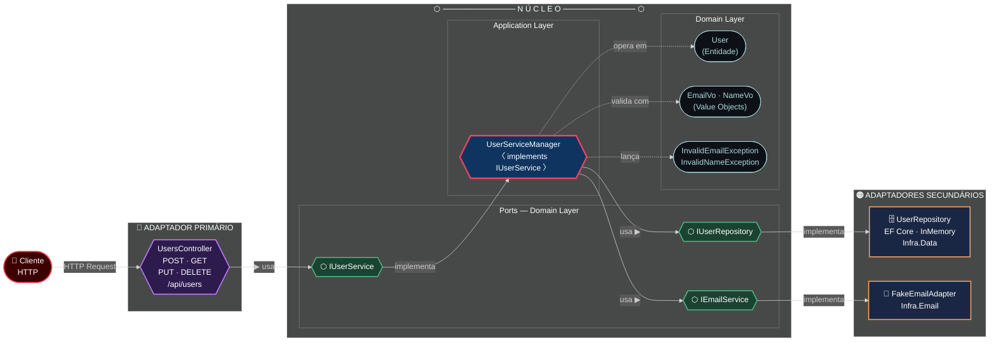

# HexagonalArch

Projeto de referência em **C# / ASP.NET Core 8** que demonstra a **Arquitetura Hexagonal** (Ports & Adapters) aplicada a um CRUD de usuários.

---

## Diagrama da Arquitetura Hexagonal



### Legenda de cores

| Cor | Camada | Papel na Arquitetura |
|---|---|---|
| 🔴 Vermelho | Cliente HTTP | Ator externo que dispara requisições |
| 🟣 Roxo | Adaptador Primário | Traduz HTTP → chamada ao núcleo (`UsersController`) |
| 🟢 Verde | Portas (Ports) | Interfaces que isolam o núcleo do mundo externo |
| 🔵 Azul | Núcleo / Application | Orquestra a lógica de negócio (`UserServiceManager`) |
| ⬛ Escuro | Domain | Entidades, Value Objects e Exceções puras |
| 🟠 Laranja | Adaptadores Secundários | Implementam as portas de saída (dados e e-mail) |

---

## Estrutura de Projetos

```
HexagonalArch.sln
├── Domain/               # Núcleo puro — sem dependências externas
│   ├── Entities/         # User
│   ├── ValueObjects/     # EmailVo, NameVo
│   ├── Exceptions/       # InvalidEmailException, InvalidNameException
│   └── Ports/            # IUserService, IUserRepository, IEmailService
│
├── Application/          # Orquestração dos casos de uso
│   └── Services/         # UserServiceManager (implements IUserService)
│
├── API/                  # Adaptador primário — REST
│   └── Controllers/      # UsersController
│
├── Infra.Data/           # Adaptador secundário — persistência
│   ├── Context/          # InMemoryContext (EF Core)
│   └── Repositories/     # UserRepository (implements IUserRepository)
│
└── Infra.Email/          # Adaptador secundário — e-mail
    └── Operations/       # FakeEmailAdapter (implements IEmailService)
```

---

## Conceitos da Arquitetura Hexagonal

| Conceito | Descrição | Exemplos no projeto |
|---|---|---|
| **Núcleo (Core)** | Lógica de negócio isolada, sem dependência de frameworks | `Domain`, `Application` |
| **Portas (Ports)** | Interfaces que definem os contratos de entrada e saída | `IUserService`, `IUserRepository`, `IEmailService` |
| **Adaptadores Primários** | Recebem requisições externas e as traduzem para o núcleo | `UsersController` |
| **Adaptadores Secundários** | Implementam as portas de saída (persistência, e-mail, etc.) | `UserRepository`, `FakeEmailAdapter` |

---

## Stack

- **Linguagem:** C# com .NET 8
- **Framework:** ASP.NET Core 8 (Web API)
- **ORM:** Entity Framework Core (InMemory para desenvolvimento)
- **Documentação API:** Swagger / OpenAPI (Swashbuckle)
- **Injeção de Dependência:** Microsoft.Extensions.DependencyInjection

---

## Como Executar

```bash
# Restaurar dependências e executar a API
dotnet run --project API
```

A API estará disponível em `https://localhost:{porta}` com Swagger em `/swagger`.

### Endpoints disponíveis

| Método | Rota | Descrição |
|---|---|---|
| `GET` | `/api/users` | Lista todos os usuários |
| `POST` | `/api/users` | Cadastra novo usuário |
| `PUT` | `/api/users/{id}` | Atualiza um usuário |
| `DELETE` | `/api/users/{id}` | Remove um usuário |
